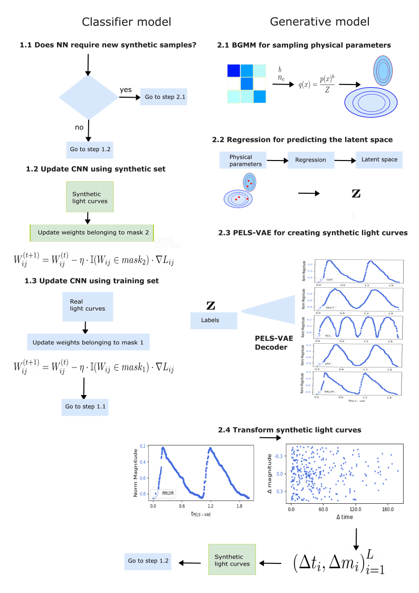

# CNN-PELSVAE

This repository contains the code for the CNN-PELSVAE project. The project, which is focused on facing the data shift problem, involves building a Convolutional Neural Network classifier with a embebbed deep generative modeling of periodic variable stars. 

# Asbtract 
Over the last two decades, machine learning models have been widely applied and have proven effective in classifying variable stars, particularly with the adoption of deep learning architectures such as convolutional neural networks, recurrent neural networks, and transformer models. While these models have achieved high accuracy, they require high-quality, representative data and a large number of labelled samples for each star type to generalise well, which can be challenging in time-domain surveys. This challenge often leads to models learning and reinforcing biases inherent in the training data, an issue that is not easily detectable when validation is performed on subsamples from the same catalogue. The problem of biases in variable star data has been largely overlooked, and a definitive solution has yet to be established. In this paper, we propose a new approach to improve the reliability of classifiers in variable star classification by introducing a self-regulated training process. This process utilises synthetic samples generated by a physics-enhanced latent space variational autoencoder, incorporating six physical parameters from {\em Gaia} Data Release 3. Our method features a dynamic interaction between the classifier and the generative model, where the generative model produces ad-hoc synthetic light curves to reduce confusion during classifier training and populate underrepresented regions in the physical parameter space.  Experiments under several scenarios demonstrate that our self-regulated training is more reliable than traditional training methods for classifying variable stars under data shift conditions, showing significant improvements in performance metrics.

# Graphical abstract 

## Conda instructions

### Setting Up the Environment
To run the CNN-PELSVAE project using Conda, follow the steps below to create a Conda environment and activate it:

### Install Conda:
If you haven't installed Conda, download and install Anaconda or Miniconda from the official website: https://docs.conda.io/projects/conda/en/latest/user-guide/install/index.html

### Clone the Repository:
Clone this repository to your local machine using Git or download the repository as a ZIP file and extract it.

### Navigate to the Project Directory:
Open a terminal or Anaconda Prompt and change the current directory to the root of the CNN-PELSVAE project.

### Create a Conda Environment:
Run the following command to create a new Conda environment named cnnpelsvae and install the required packages listed in the requirements.txt file:

`conda create --name cnnpelsvae --file requirements.txt`

Activate the Conda Environment:
After the environment is created, activate it using the following command:

`conda activate cnnpelsvae`

Now that the Conda environment is set up and activated, you are ready to run the CNN-PELSVAE model:

### Execute the Main Script:
Use the python command to execute the main script (main.py or any other appropriate script) that contains the CNN-PELSVAE model and other relevant code:

`python classifier_main.py`

### Deactivate the Environment:
After you are done with the CNN-PELSVAE model execution, deactivate the Conda environment:

`conda deactivate`

By following these instructions, you can create an isolated Conda environment with the required dependencies to run the CNN-PELSVAE project. This ensures consistency and reproducibility across different environments.

## Notebooks Description

- `1.cnn_architecture.ipynb`: Presents the Convolutional Neural Network (CNN) architecture, including initialization and hyperparameter settings, along with a use case example.

- `2.data_flow_to_obtain_light_curves.ipynb`: Introduces the `SyntheticDataBatcher` class and details the complete flow to generate realistic light curves, including defolding, scaling, and sampling of physical parameters.

- `3.priorization_of_samples.ipynb`: Contains methods to prioritize samples based on confusion matrix information, helping to decide the required sample count for each class.

- `4.fit_of_bgmm.ipynb`: Demonstrates the `BayesianGaussianMixtureModel` class and its methods, showing how Bayesian Gaussian Mixture Models are fitted and utilized.

- `5.sampler_bgmm.ipynb`: Shows the sampling approach used to obtain physical parameters, highlighting the underlying strategy and methodology.

- `6.regression_pp_ls.ipynb`: Provides methods for obtaining the latent space from an instance of physical parameters, with metrics and visualizations to validate prediction accuracy.

- `7.revert_folded_light_curves.ipynb`: Describes the process of transforming folded and normalized light curves back into raw light curves, suitable for classification.

- `8.get_times_validation.ipynb`: Illustrates how real light curves are processed to obtain time sequences for a given class and period.

- `9.plot_light_curves.ipynb`: Provides functions to visualize both folded and non-folded light curves, aiding in data analysis and presentation.

